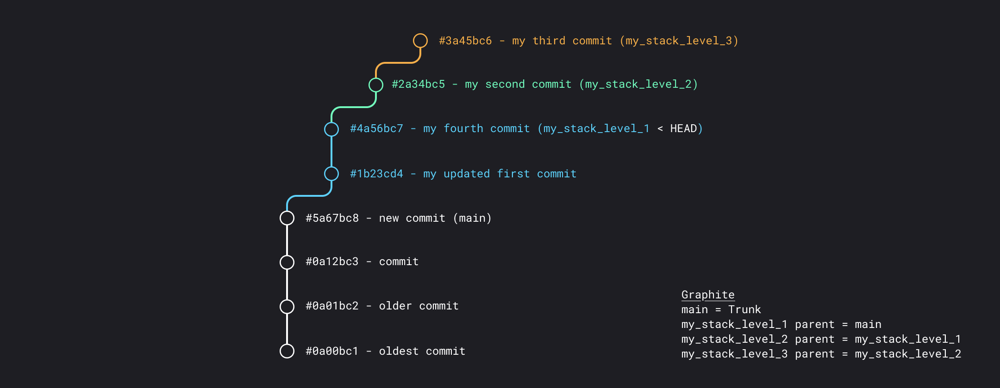

# Updating a mid-stack branch


Stacked changes aren't just about adding more branches on top - sometimes you want to go back and change something mid-stack.  Graphite makes it easy to update a mid-stack branch, and automatically rebases the changes you have stacked on top.


## Adding commits

Let's say you receive some comments in code review that you want to address with a new commit before landing a branch in the middle of your stack - here's how you'd do this with `gt`:

```bash
# address review comments with a new commit
gt branch checkout my_stack_level_1
gt commit create -a -m "my fourth commit" # -> automatically rebases both upstack branches
```



## Amending commits

If you prefer to just amend a previous commit, this is just as easy with `gt`:

```bash
# address review comments by amending a commit
gt branch checkout my_stack_level_1
gt commit amend -a -m "my updated commit" # -> automatically rebases both upstack branches
```

## Resolving rebase conflicts

If `gt commit create` or `gt commit amend` encounter any conflicts as they recursively rebase your stacked branches, you'll be prompted to resolve your conflicts before continuing.  You can do this with the following workflow:

```
# find which files have conflicts
gt status

# * resolve the rebase conflicts *

# add your changes
gt add -A

# continue the rebase operation
gt continue
```

Here's a video walkthrough of what this looks like:



Now that you can create, navigate, and update stacks, it's time to turn them into pull requests!
