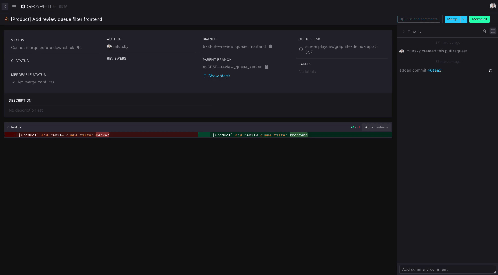

# Merging your pull requests

## Merging a single PR

Once your PR has been approved & is passing CI (+ any other checks/merge protections you've enabled in GitHub), you'll be able to merge it from Graphite.  Merging a single PR is easy - just hit "Merge" on the right side of the PR title bar.

You can use the dropdown on the `Merge` button to select a different merge strategy (Graphite will pull in your default merge strategy from GitHub).  Once your PR has been merged, you'll see a confirmation snackbar in the bottom left corner of the screen.


If you're using the Graphite CLI, you'll want to make sure to run `gt repo sync` immediately after merging in a change to your remote trunk branch - this ensures that your local environment is up-to-date and ready for you to keep developing!


## Merging a stack of PRs

When you view a PR that is part of a stack (and not the bottom-most PR in that stack), instead of the `Merge` button you'll see `Merge all (n)`, where "n" is the number of PRs below the current PR in the stack + the current PR.  `Merge all (n)` lets you kick off a job to have Graphite merge every PR in the stack up thru the current PR into your trunk branch, starting from the bottom of the stack.&#x20;

You can select a merge strategy for `Merge all (n)` to use, and it will run until it either completes the merges thru the PR you triggered it from, or until it hits a merge conflict or CI failure (at which point it will stop).

`Merge all (n)` will also add a comment to the affected PRs in GitHub, so that your colleagues can see that those PRs are queued to be merged or are in the process of being merged:

These statuses will similarly be displayed on the PR on the Graphite dashboard.


If `Merge all (n)` fails due to a rebase conflict, go to your terminal and run `gt repo sync && gt stack fix && gt stack submit` (resolving any conflicts along the way and running `gt continue`).  Once you've done this, go back to the affected PR in Graphite (or to the same place in the stack where you initially kicked off the `Merge all (n)` job), and click `Merge all (n)` one more time to re-queue the PR for merging.

